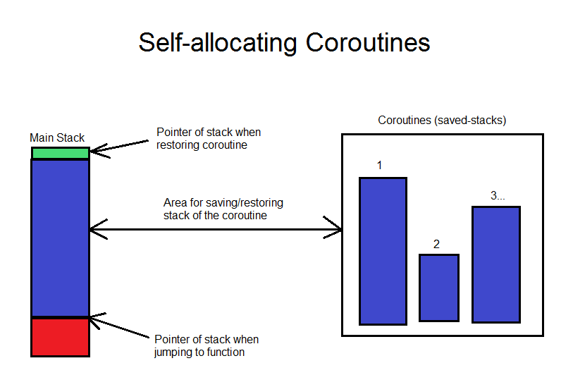

### Dynamic Coroutines - Proof of Concept

This is a basic implementation of what I have dubbed "dynamic" coroutines. I wanted coroutines in programs I've written, but ran into two main problems. First, you don't know how big the stack must be per coroutine, so you must do guess work with overcompensation in how much is allocated for each. Second, on some systems the thread manager may perform checks on the stack pointer of the thread running the coroutine, and do unwanted things when it sees the stack pointer outside the range it allocated it.

The traditional way of doing stackful coroutines is to allocate memory for your stack, then point the stack pointer to the heap, and finally jump to the function in question. Whenever yielding, the state is saved and `longjmp` is used to go back to the original state.

The dynamic way uses a new system to tackle the two issues mentioned before. Instead, a marker is placed to save the current stack position and the function is then executed normally. Whenever the function needs to yield, the stack is then marked again to create start and end points (hereby the "delta") of the state of the function. Memory is allocated on the heap of this size, and the stack is copied there. As usual `longjmp` is used to return to the scheduler.

Now... this is where the magic happens. Upon the next time the function is executed, the stack pointer is then moved to above where it was when the function last yielded. The saved state from the heap is then copied back onto the stack (underneath) where the pointer currently is. Finally, `longjmp` is used as normal to jump back into the old state.

Using this system allows the stack size to grow as needed and manage itself without the annoying guesswork/stack overflows of pre-allocation. It also avoids potential security triggers caused by modern operating systems using the traditional method.

Current limitations are:
- If the stack pointer is above where it was when the scheduler last ran, it will clobber the delta (this can be fixed by copying the current stack before jumping to the saved one, I just didn't do it).
- Only implemented and tested on `x86` and `mips` processors. Will add more in the future
